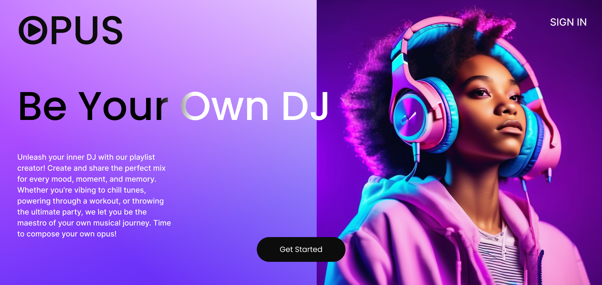
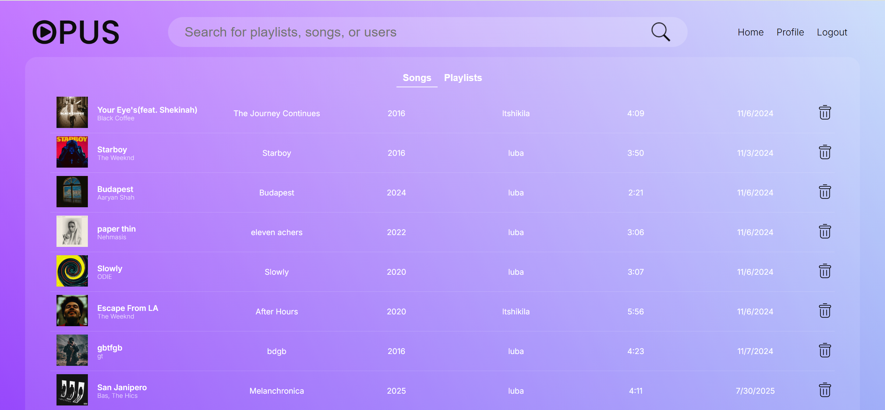
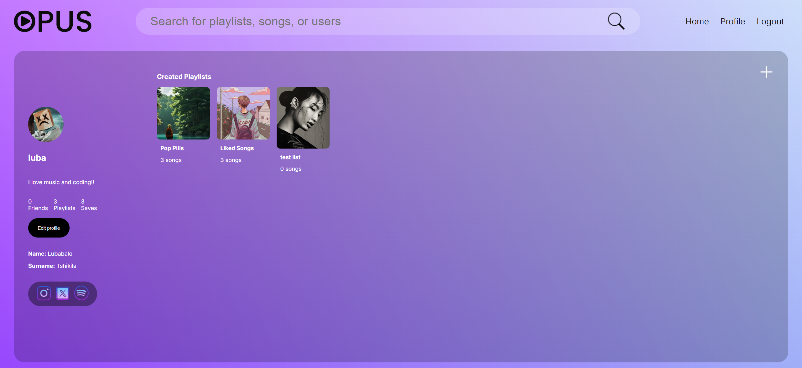
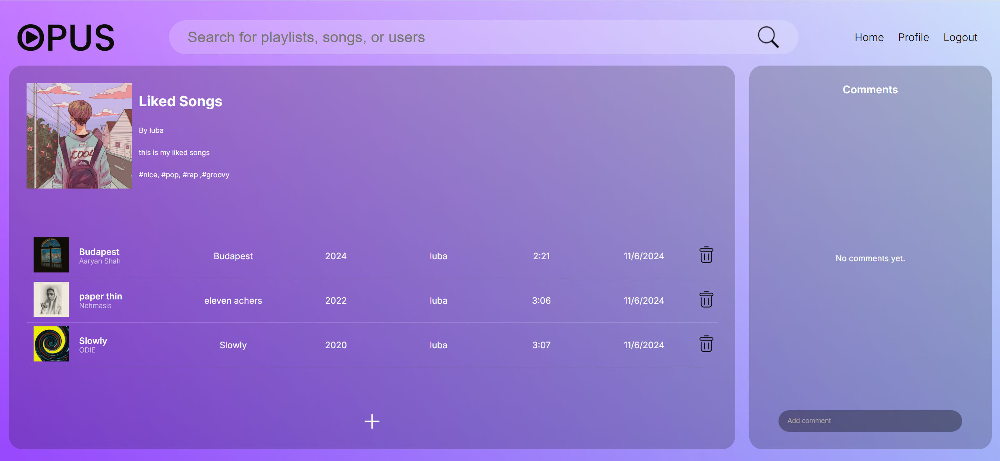

# Opus - Playlist Creation Platform

## Overview

Opus is a modern playlist creation and sharing platform that allows users to "Be Your Own DJ." Built with React and Node.js, it provides a comprehensive music management experience where users can create playlists, discover music, connect with friends, and share their musical creations.

The platform features a sleek, modern interface with gradient backgrounds and intuitive navigation, making it easy for users to manage their music collections and social connections.

## Features

### 🎵 Music Management
- **Song Upload**: Add songs with metadata (title, artist, album, year, length, cover art)
- **Playlist Creation**: Create and customize playlists with cover art, descriptions, and tags
- **Music Discovery**: Browse songs and playlists from other users
- **Search Functionality**: Find songs, playlists, and users with fuzzy search

### 👥 Social Features
- **User Profiles**: Customizable profiles with bio, profile pictures, and social media links
- **Friend System**: Add/remove friends and view their playlists
- **Comments**: Comment on playlists and engage with the community
- **Activity Feed**: View recent songs and playlists from the community

### 🔐 Authentication
- **User Registration**: Secure signup with email validation
- **Login System**: Persistent login sessions
- **Profile Management**: Edit personal information and preferences

### 🎨 User Interface
- **Modern Aesthetics**: Gradient backgrounds and smooth animations
- **Intuitive Navigation**: Easy-to-use interface with clear navigation paths

## Technology Stack

### Frontend
- **React 18.3.1** - Component-based UI library
- **React Router DOM 6.26.2** - Client-side routing
- **CSS3** - Custom styling with gradients and animations
- **Webpack 5.94.0** - Module bundler
- **Babel** - JavaScript compiler for modern syntax support

### Backend
- **Node.js** - JavaScript runtime environment
- **Express.js 4.21.1** - Web application framework
- **MongoDB 6.9.0** - NoSQL database for data storage
- **CORS 2.8.5** - Cross-origin resource sharing middleware

### Development Tools
- **Docker** - Containerization for consistent deployment
- **Nodemon** - Development server with auto-restart
- **Babel CLI** - Command-line interface for Babel transpilation

## Screenshots

### Main Features

## Contact

**Author**: Lubabalo Tshikila  
**Email**: ltshikila17@gmail.com

*"Be Your Own DJ with Opus - Where every playlist tells a story"*